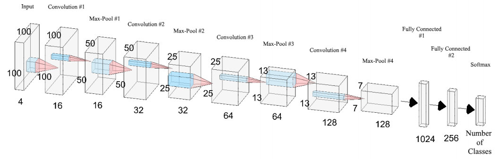

# FruitClassifier

A reimplementation of [ArXiv paper 1712.00580](https://arxiv.org/abs/1712.00580) using TF 2.0's high level APIs.

## TF 2.0 APIs Used
- New `tf.data` API
    - lazy fetched dataset!
- Improved `tf.keras` API

## Network Structure
*(pulled from the original paper)*

    

## Disclaimer
I did not write the paper or create the dataset. Most of the work
was done by the paper authors. I implemented their network
in TF 2.0 using the Keras API as a learning exercise.